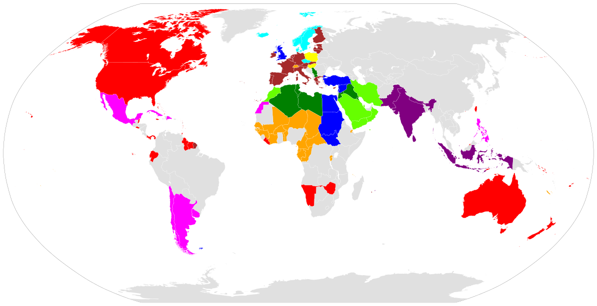
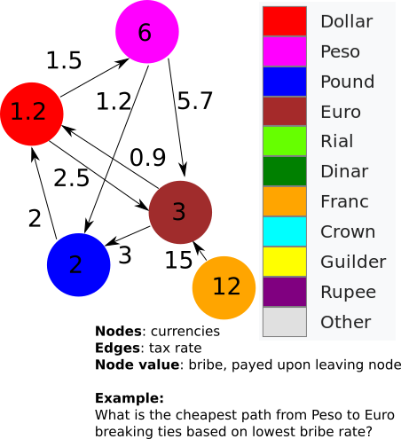

Programming assignment 9 (PA09) - Final Project
==============================

# NOTE:
* The code on the assignment was written by me, but the assignment was originally made by Dr. Taylor @ MST.

# Shortest paths and currency exchange

## The World's curriencies (a small subset):

Color key below

## Problem: Move your money

* Your goal is to move your money minimizing losses to taxes (edges) and bribes (nodes).
* In choosing a path, choose the lowest cost (shortest path) primarily based on edge-weight, and only secondarily breaking ties by bribe rate if there are two equivalent shortest paths. 

## You are required to submit 1 files:
* dijkstra.cpp (make sure you spell this correctly)
* You can submit other files, though you are not required to do so.

## Input and output files
* Input will be via cin / standard input (as before).
* Output will be via cout / standard output (as before).

### Input files
* We give you a weighted directed graph.
* The file format is csv (comma separated value) file containing a matrix of exchange rates, with row and column headers as node-names and bribe costs (in parentheses).
* The matrix file also has a question at the end. You must parse this to determine the desired path to be printed.
* Note: the number of commas is significant. Make sure you understand the file format.
* Left row indices are "from" and top column headers are "to" in the graph.

### Output files
* Example given.
* Note: you will need to add/remove plurality with currency names, including new ones that we test with.
* Make sure formatting matches; use methods below:

## Running
`$ g++ dijkstra.cpp -std=c++11`

`$ ./a.out <sample_input.csv >your_output.txt`

`$ diff your_output.txt sample_output.txt`

## Grading
* Create some graphs of your own to test bigger input sets.
* There is no speed component
* You must use Dijkstra's algorithm with a priority queue
* You can (and are encouraged) to use http://en.cppreference.com/w/cpp/container/priority_queue or any other std:: containers you like.
* With this open-ended format, unit testing will not be possible. You will be graded on your output, and the use of correct code and specified algorithms.
* We will test with other currencies, and the graph may be arbitrarily large.
* Not all nodes will be reachable, and you will need to report that when it occurs with your destination (see demo).

### Late work and regrades
* I have given as much time as possible before grades are due. If it's not in by the deadline, your grade for the final will be a 0. Get started early!
* There is no time for re-checks. Make sure you pay attention to detail.

# General notes

The files listed here are the starting point for your assignment. 
Only add source files (not compiled files) to the Git repository.

Remember, the assignment due date is posted on the course website:

https://web.mst.edu/~taylorpat/Courses_files/DataStructures/Content.html

Git commands and a Git cheat-sheet are posted at the following link, under the heading "Programming Assignments":

http://web.mst.edu/~taylorpat/Courses_files/DataStructures/Syllabus.html

